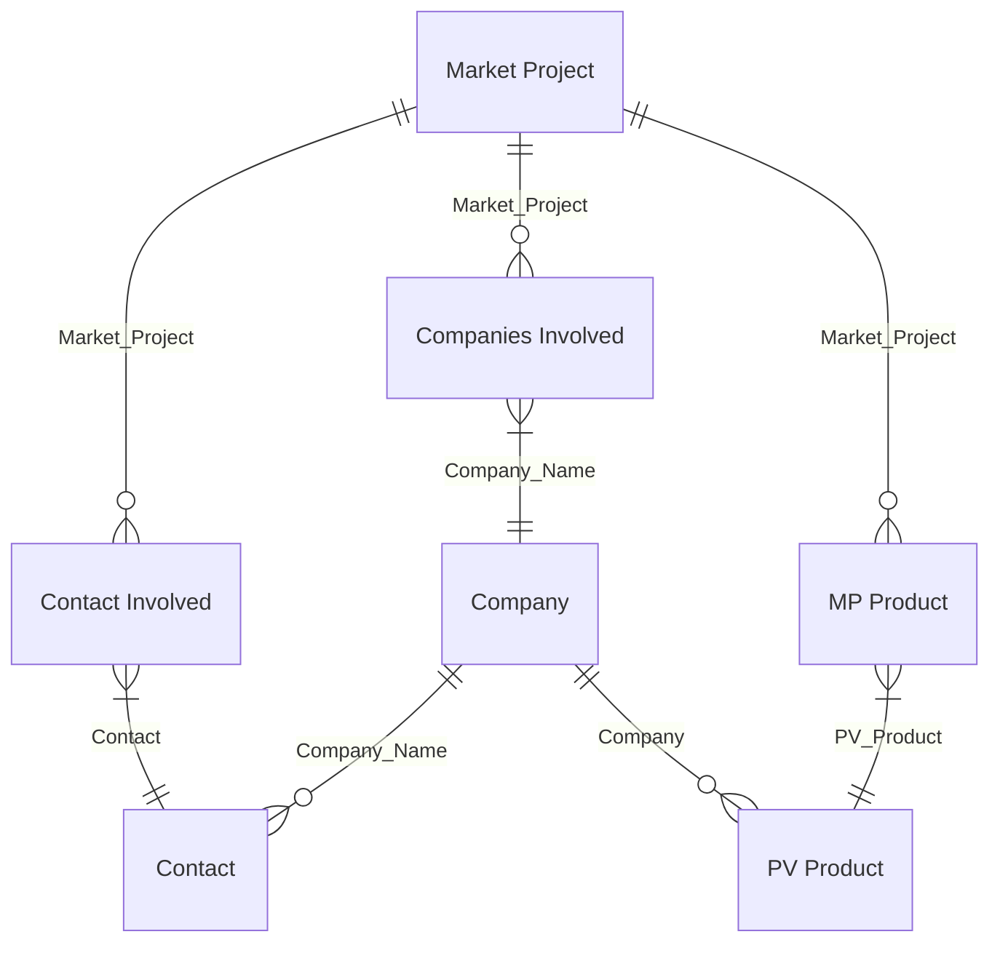

```mermaid
erDiagram


     

    
    %% Company ||--o{ "PV Product" : "1对多（通过Company字段关联）"
    
    %% "Market Project" ||--o{ "Contact Involved" : "1对多（通过Market Project字段关联）"
    %% "Contact Involved" }|--|| "Contact" : "1对多\n（通过Contact字段关联）"
    %% %% Contact ||--o{ "Conatct Involved" : "1对多（通过Conatct字段关联）"
    %% Company ||--o{ "Contact" : "1对多（通过Company Name关联）"
    %% %% Company ||--o{ "Companies Involved" : "1对多（通过Company Name关联）"
    %% "Companies Involved" }|--|| "Company" : "多对一（通过Contact字段关联）"
    %% "Market Project" ||--o{ "Companies Involved" : "1对多（通过Master Project字段关联）"
    

    %% "Market Project" ||--o{ "MP Product" : "1对多（通过Market Project字段关联）"
    %% "MP Product" }|--|| "PV Product" : "1对多（通过PV Product字段关联）"
    
    Company ||--o{ "PV Product" : "Company"
    "Market Project" ||--o{ "Contact Involved" : "Market_Project"
    "Contact Involved" }|--|| "Contact" : "Contact"
    Company ||--o{ "Contact" : "Company_Name" 
    "Companies Involved" }|--|| "Company" : "Company_Name"
    "Market Project" ||--o{ "Companies Involved" : "Market_Project"
    "Market Project" ||--o{ "MP Product" : "Market_Project"
    "MP Product" }|--|| "PV Product" : "PV_Product"
```