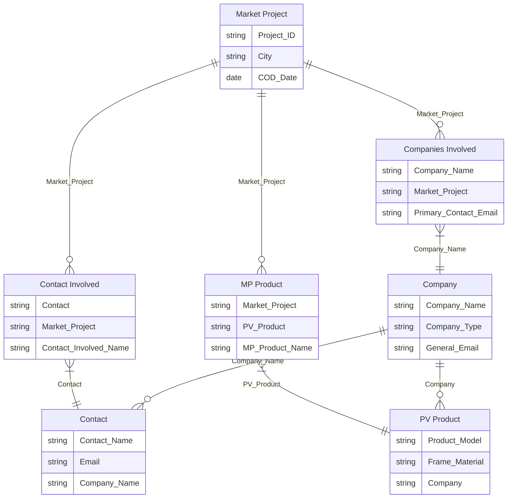

```mermaid
erDiagram
    %% ---------------------------------------------------------
    %% 1. 实体定义 (内容不变)
    %% ---------------------------------------------------------
    "Market Project" {
        string Project_ID
        string City
        date COD_Date
    }
    "Companies Involved" {
        string Company_Name
        string Market_Project
        string Primary_Contact_Email
    }
    "Contact Involved" {
        string Contact
        string Market_Project
        string Contact_Involved_Name
    }
    "MP Product" {
        string Market_Project
        string PV_Product
        string MP_Product_Name
    }
    Company {
        string Company_Name
        string Company_Type
        string General_Email
    }
    Contact {
        string Contact_Name
        string Email
        string Company_Name
    }
    "PV Product" {
        string Product_Model
        string Frame_Material
        string Company
    }

    %% ---------------------------------------------------------
    %% 2. 关系流向控制 (这是布局的关键！)
    %% 逻辑顺序：Top -> Middle -> Bottom
    %% ---------------------------------------------------------

    %% === 第一层流向：从 Top (Market Project) 指向 Middle ===
    %% 将 Market Project 放在左边，它是“根”，会定在最上方
    "Market Project" ||--o{ "Companies Involved" : "Market_Project"
    "Market Project" ||--o{ "Contact Involved" : "Market_Project"
    "Market Project" ||--o{ "MP Product" : "Market_Project"

    %% === 第二层流向：从 Middle 指向 Bottom ===
    %% 这会让 Company 和 Contact 被“推”到图表下方
    "Companies Involved" }|--|| "Company" : "Company_Name"
    "Contact Involved" }|--|| "Contact" : "Contact"
    "MP Product" }|--|| "PV Product" : "PV_Product"

    %% === 第三层：Bottom 实体之间的横向关联 ===
    %% 这些写在最后，避免干扰主干的上下层级
    Company ||--o{ "Contact" : "Company_Name"
    Company ||--o{ "PV Product" : "Company"
```