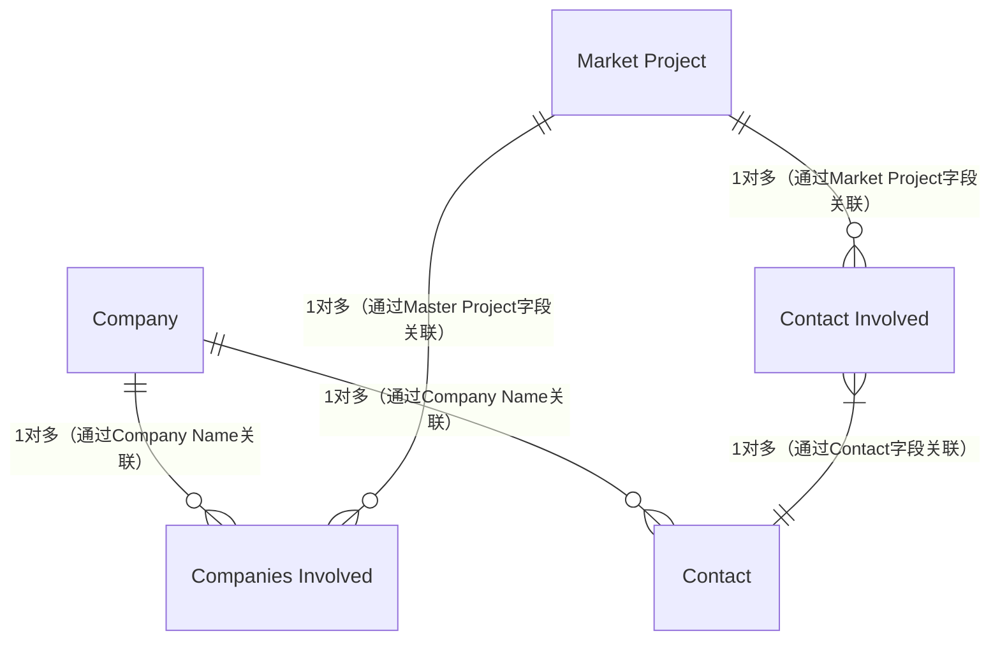

```mermaid
erDiagram
 Company ||--o{ "Contact" : "1对多（通过Company Name关联）"
    Company ||--o{ "Companies Involved" : "1对多（通过Company Name关联）"
    %% Company ||--o{ "PV Product" : "1对多（通过Company字段关联）"
    "Contact Involved" }|--|| "Contact" : "1对多（通过Contact字段关联）"
   
    "Market Project" ||--o{ "Companies Involved" : "1对多（通过Master Project字段关联）"
    "Market Project" ||--o{ "Contact Involved" : "1对多（通过Market Project字段关联）"
    %% "Market Project" ||--o{ "MP Product" : "1对多（通过Market Project字段关联）"
    %% "MP Product" }|--|| "PV Product" : "多对1（通过产品参数关联，如Frame Material）"
   
    %% Contact ||--o{ "Conatct Involved" : "1对多（通过Conatct字段关联）"
```