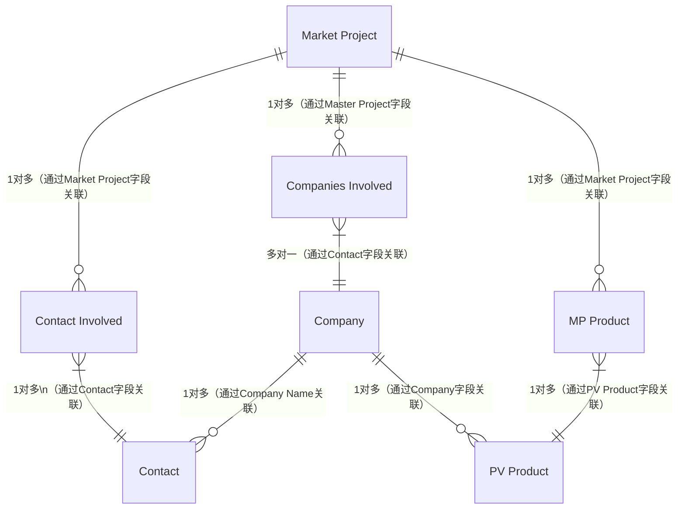

```mermaid
erDiagram


    %% -- 中间关联层最后声明，放在右侧/底部
    %% "Market Project" {
    %%     string Project_ID
    %%     string City
    %%     date COD_Date
    %% }

    %% "Companies Involved" {
    %%     string Company_Name
    %%     string Market_Project
    %%     string Primary_Contact_Email
    %% }
    %% "Contact Involved" {
    %%     string Contact
    %%     string Market_Project
    %%     string Contact_Involved_Name
    %% }
    %% "MP Product" {
    %%     string Market_Project
    %%     string PV_Product
    %%     string MP_Product_Name
    %% }
    %% %% -- 核心主实体优先声明，放在左侧/顶部
    %% Company {
    %%     string Company_Name
    %%     string Company_Type
    %%     string General_Email
    %% }
   
    %% %% -- 关联实体次之，围绕主实体排布
    %% Contact {
    %%     string Contact_Name
    %%     string Email
    %%     string Company_Name
    %% }
    %% "PV Product" {
    %%     string Product_Model
    %%     string Frame_Material
    %%     string Company
    %% }

    
    Company ||--o{ "PV Product" : "1对多（通过Company字段关联）"
    
    "Market Project" ||--o{ "Contact Involved" : "1对多（通过Market Project字段关联）"
    "Contact Involved" }|--|| "Contact" : "1对多\n（通过Contact字段关联）"
    %% Contact ||--o{ "Conatct Involved" : "1对多（通过Conatct字段关联）"
    Company ||--o{ "Contact" : "1对多（通过Company Name关联）"
    %% Company ||--o{ "Companies Involved" : "1对多（通过Company Name关联）"
    "Companies Involved" }|--|| "Company" : "多对一（通过Contact字段关联）"
    "Market Project" ||--o{ "Companies Involved" : "1对多（通过Master Project字段关联）"
    

    "Market Project" ||--o{ "MP Product" : "1对多（通过Market Project字段关联）"
    "MP Product" }|--|| "PV Product" : "1对多（通过PV Product字段关联）"
    
    %% Company ||--o{ "PV Product" : "Company"
    %% "Market Project" ||--o{ "Contact Involved" : "Market_Project"
    %% "Contact Involved" }|--|| "Contact" : "Contact"
    %% Company ||--o{ "Contact" : "Company_Name" 
    %% "Companies Involved" }|--|| "Company" : "Company_Name"
    %% "Market Project" ||--o{ "Companies Involved" : "Market_Project"
    %% "Market Project" ||--o{ "MP Product" : "Market_Project"
    %% "MP Product" }|--|| "PV Product" : "PV_Product"
```